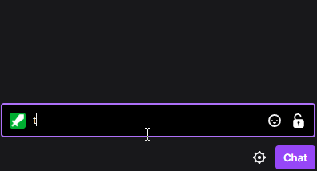
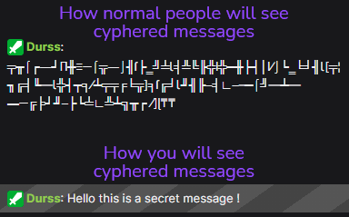
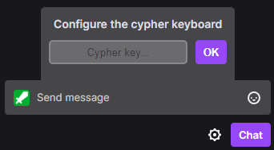

# Cypher keyboard for Twitch

This script allows you to send secret messages publicly on a Twitch chat.
Normal people will see cryptic chars, you will see the secret message.

<div align="center"></div>

<div align="center"></div>
<br>
<br>

## Installation

1. Download [Greasemonkey](https://addons.mozilla.org/fr/firefox/addon/greasemonkey/) on Firefox or [Tampermonkey](https://chrome.google.com/webstore/detail/tampermonkey/dhdgffkkebhmkfjojejmpbldmpobfkfo) for Chromium base browsers *(Chrome, Vivaldi, Edge, Brave,...)*
2. Install the script by clicking [`this link`](twitchCyperKeyboard.user.js)
3. Go on a Twitch channel, you should be asked to set the **cypher key**. Set anything you want but keep it somewhere to share it with your friends !
<br>
<br>
<br>
## Configuration
Once you installed the script this will be displayed on chat :
<div align="center"></div>
Write any secret key you want in the field and share it with the people you want to exchange secret messages with.
<br>
<br>
<br>

## Change cypher key
If you want to update the cypher key you can send this command to reset the extension :
```
!resetCypherKeyboard
```